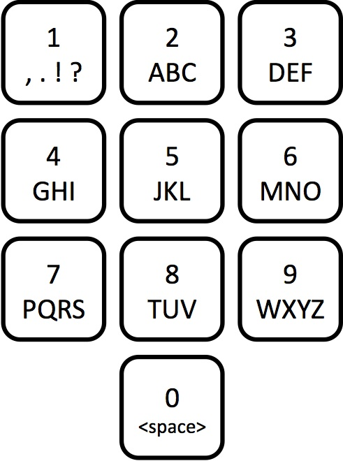

# Numbers on Telephone in Python

**Hello everyone!** Confused with the code?\
Here is the step, just enter the number separated with space.

**Sample Input:**\
2 55 88 0 44 33 22 2 8

**Sample Output:**\
aku hebat
